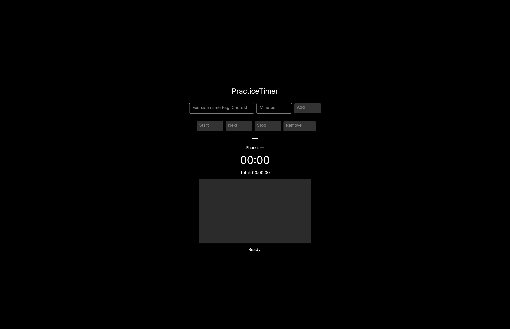

# PracticeTimer (MVP)

A simple desktop practice timer built with **C#**, **.NET**, **Avalonia UI**, and the **MVVM pattern**.

The goal of this project is not feature completeness, but a **clean and understandable MVP (Minimum Viable Product)** that demonstrates solid application structure, state management, and user interaction.

---

## 🎥 Demo

[](https://github.com/Malte95/PracticeTimer/releases/tag/v1.0-demo)

Click the image to open the demo video (GitHub Release).

---

## Features

- Add practice exercises (name + duration in minutes)
- Remove exercises (only when the session is not running)
- Start a practice session
- Automatic countdown timer
- Automatic switch to the next exercise
- Stop the session at any time

---

## Why MVP?

During development, the project was intentionally reduced to a **Minimum Viable Product (MVP)**.

This decision helped to:

- focus on the core session flow
- avoid unnecessary complexity
- keep the codebase readable and explainable
- clearly separate **edit state** and **running session state**

The project is structured so that new features could be added later without redesigning the core logic.

---

## Architecture & State Management

- **MVVM pattern** using CommunityToolkit.MVVM
- The UI works directly with an editable `Phases` list
- When the session starts, a new `PracticeSession` is built from the UI state
- While the session is running:
  - editing is disabled
  - the running session state is isolated from the UI edit state
- This avoids inconsistent state and keeps the session logic predictable

---

## Tech Stack

- C#
- .NET
- Avalonia UI
- CommunityToolkit.MVVM

---

## What I Learned

- Applying the MVVM pattern in a real desktop application
- Using command-based UI logic and input validation
- Managing clear state transitions (edit → running → stopped)
- Building a focused MVP instead of overengineering features
- Structuring UI logic so it stays testable and maintainable

---

## Future Ideas (Out of MVP scope)

- Pause / resume functionality
- Preset management
- Progress bar for current exercise and total session
- Keyboard shortcuts
- Session history / statistics

These features were intentionally left out of the MVP to keep the project focused, clean, and easy to explain.

---

## How to run

```bash
dotnet restore
dotnet run --project PracticeTimer.Gui


